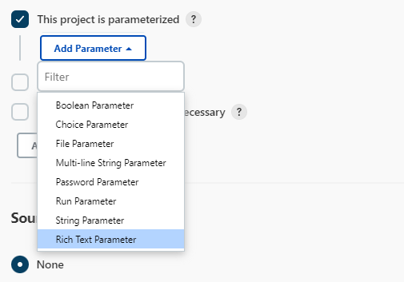
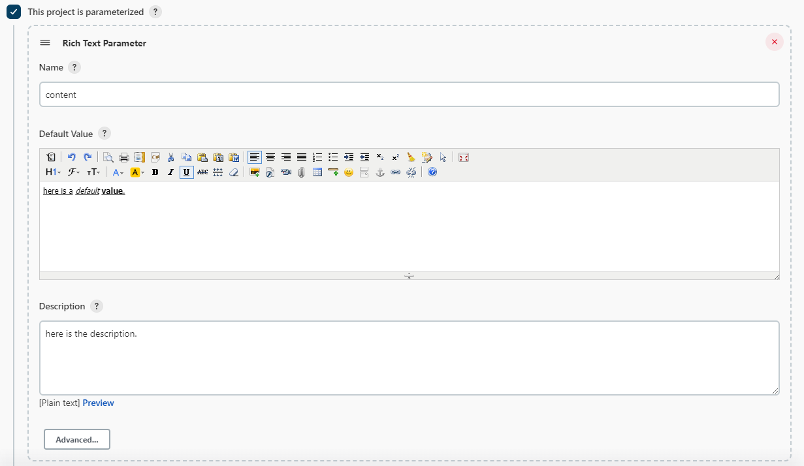
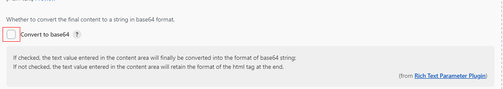

# rich-text-parameter-plugin

## Introduction

This is a rich text parameter plugin just for parameterized project which needs complex formatted text such as html tags etc.

## Getting started
1. if a project is parameterized, choose **Rich Text Parameter** in the dropdown list menu when you clicked **Add Parameter**.
    
2. config fields value as you need.
   
3. in advanced config, there is a switch to controll whether convert the final content to [Base64](https://en.wikipedia.org/wiki/Base64) formatted or not.
   

## Issues

Report issues and enhancements in the [Jenkins issue tracker](https://issues.jenkins-ci.org/).

## Contributing

see [CONTRIBUTING](CONTRIBUTING.md)

## LICENSE

Licensed under MIT, see [LICENSE](LICENSE.md)

